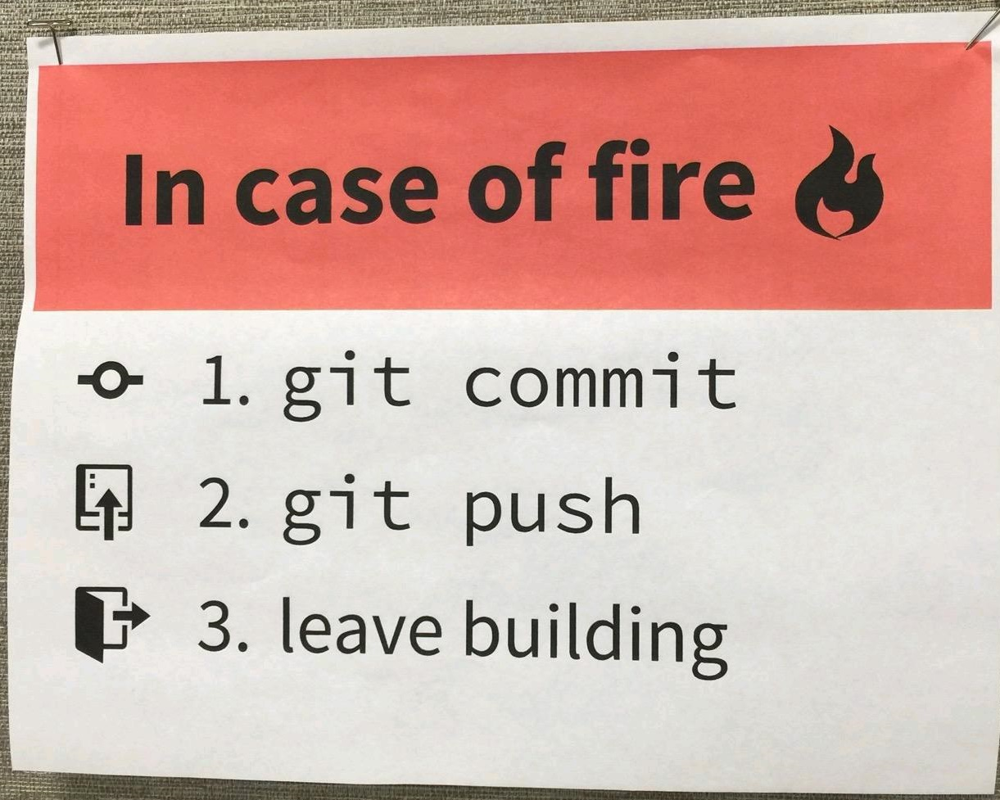

# Правила работы с git

`Декодированое сообщение от L: 02.aes`

Я отправил G еще одно сообщение, в котором я рассказываю про git.

В мире разработки очень важно иметь возможность управлять своим кодом и работать в распределенных командах. Это позволяет эффективно и быстро писать код и делиться им со братьями по оружию. 

В этом сообщении я собрал для тебя основные команды которые могут тебе пригодиться при работе с GIT - репозиториями.

Если упражнаться с гитом и изучать его - можно разблокировать навык git-master-тян. Он позволит тебе управлять проектами и разворачивать приложения на удаленных серверах имея перед собой только терминал, а также позволит небояться чертоны консоли.



## Основные положения

1. Требования к комитам:
    - лучше много частых комитов чем один большой
    - имена комитов должны быть осмысленные
    - было бы здорово использовать прифекы комитов:
        - `fix:` - для исправления чего-либо (`fix: users counter`)
        - `feat:` - для добавления новых функций (`feat: add bileniar image resize`)
        - `upd:` - для обновления пакетов или зависимостей (`upd: tensorflow 2.3 -> 2.3.2`)
        - `merge:` - для пулл реквестов и мержа веток (`merge: release 2.1.2`)
2. Ветки git:
    1. Защитите основную ветку вашего репозитория (`master` или `main`) от изменений
        - Settings - Branches - Protected Branches - chose a brench
    2. В каждом репозитории заводятся 2 ветки:
        - `master` или  `main` - тут лежит последняя стабильная версия ПО
        - `dev` - ветка для принятия и мерджа пулл реевестов
    3. Ветка `master` - защщищена от изменений и может быть обновлена только с помощью pr реквеста.
    4. Ветка `dev` - служит для предварительного merge-а pr из временных веток. комит туда может быть сделан только в случае hotfix-а.
    5. Под каждую новую задачу должна быть заведена своя ветка. В ней ведется разработка основной фичи / фикса.
    6. По завершению разработки этой фичи - делается pr в ветку `dev` а временная ветка для фичи - удаляется.
    7. После принятия изменений в dev ветку - происходит тестирование приложения в dev контуре.
    8. По завершению тестирования делается PR в `master` с тегом версии релиза.
    9. Обновление накатывается на продакшен сервера.
6. Не храните конфиги в git. Все конфиги должны быть игнорированы git ом с помощью `gitignore` или `git update-index --skip-worktree <path-name>`. Подробнее [тут](https://stackoverflow.com/questions/936249/how-to-stop-tracking-and-ignore-changes-to-a-file-in-git).
7. Если в git репозитории работают 2 и более человек - используйте code-review перед аппрувом pr.

> Данный подход является упрощенной версией принципа git-flow где вместо 2 постоянных веток (master и dev) - 4 ветки (master, dev, release, hotfix).

## Краткий мануал по git

### Первоначальная настройка

> Настройка информации о пользователе для всех локальных репозиториев

```sh
git config --global user.name "[имя]"
```

Устанавливает имя, которое будет отображаться в поле автора у выполняемых вами коммитов

```sh
git config --global user.email "[адрес электронной почты]"
```

Устанавливает адрес электронной почты, который будет отображаться в информации о выполняемых вами коммитах

### Создание репозитория

```sh
git init [название проекта]
```

Создаёт новый локальный репозиторий с заданным именем

```sh
git clone [url-адрес]
```

Скачивает репозиторий вместе со всей его историей изменений

### Операции с файлами

> удаление и перемещение файлов

```sh
git rm [файл]
```

Удаляет конкретный файл из рабочей директории и индексирует его удаление

```sh
git rm --cached [файл]
```

Убирает конкретный файл из контроля версий, но физически оставляет его на своём месте

```sh
git mv [оригинальный файл] [новое имя]
```

Перемещает и переименовывает указанный файл, сразу индексируя его для последующего коммита
Игнорирование некоторых файлов

### Исключение временных и вторичных файлов и директорий

```sh
*.log
build/
temp-*
```

Git будет игнорировать файлы и директории, перечисленные в файле `.gitignore` с помощью wildcard синтаксиса

```sh
git ls-files --others --ignored --exclude-standard
```

Список всех игнорируемых файлов в текущем проекте

### Сохранение фрагментов

> Сохранение и восстановление незавершённых изменений

```sh
git stash
```

Временно сохраняет все незафиксированные изменения отслеживаемых файлов

```sh
git stash pop
```

Восстанавливает состояние ранее сохранённых версий файлов

```sh
git stash list
```

Выводит список всех временных сохранений

```sh
git stash drop
```

Сбрасывает последние временно сохранённыe изменения

### Внесение изменений

> Просмотр изменений и создание коммитов (фиксация изменений)

```sh
git status
```

Перечисляет все новые или изменённые файлы, которые нуждаются в фиксации

```sh
git diff
```

Показывает различия по внесённым изменениям в ещё не проиндексированных файлах

```sh
git add [файл]
```

Индексирует указанный файл для последующего коммита

```sh
git diff --staged
```

Показывает различия между проиндексированной и последней зафиксированной версиями файлов

```sh
git reset [файл]
```

Отменяет индексацию указанного файла, при этом сохраняет его содержимое

```sh
git commit -m "[сообщение с описанием]"
```

Фиксирует проиндексированные изменения и сохраняет их в историю версий

### Ветки

> Именованные серии коммитов и соединение результатов работы

```sh
git branch
```

Список именованных веток коммитов с указанием выбранной ветки

```sh
git branch [имя ветки]
```

Создаёт новую ветку

```sh
git checkout [имя ветки]
```

Переключается на выбранную ветку и обновляет рабочую директорию до её состояния

```sh
git merge [имя ветки]
```

Вносит изменения указанной ветки в текущую ветку

```sh
git branch -d [имя ветки]
```

Удаляет выбранную ветку

### Просмотр истории

> Просмотр и изучение истории изменений файлов проекта

```sh
git log
```

История коммитов для текущей ветки

```sh
git log --follow [файл]
```

История изменений конкретного файла, включая его переименование

```sh
git diff [первая ветка]...[вторая ветка]
```

Показывает разницу между содержанием коммитов двух веток

```sh
git show [коммит]
```

Выводит информацию и показывает изменения в выбранном коммите

### Откат коммитов

> Удаление ошибок и корректировка созданной истории

```sh
git reset [коммит]
```

Отменяет все коммиты после заданного, оставляя все изменения в рабочей директории

```sh
git reset --hard [коммит]
```

Сбрасывает всю историю вместе с состоянием рабочей директории до указанного коммита.

### Синхронизация с удалённым репозиторием

> Регистрация удалённого репозитория и обмен изменениями

```sh
git fetch [удалённый репозиторий]
```

Скачивает всю историю из удалённого репозитория

```sh
git merge [удалённый репозиторий]/[ветка]
```

Вносит изменения из ветки удалённого репозитория в текущую ветку локального репозитория

```sh
git push [удалённый репозиторий] [ветка]
```

Загружает все изменения локальной ветки в удалённый репозиторий

```sh
git pull
```

Загружает историю из удалённого репозитория и объединяет её с локальной. pull = fetch + merge
